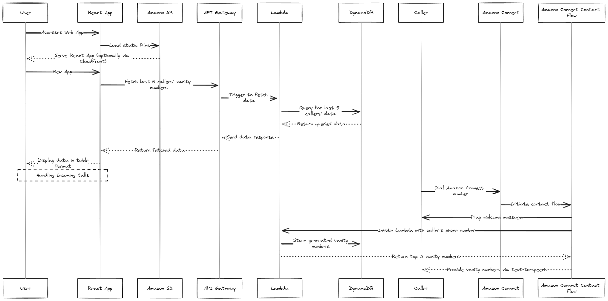

### Vanity Number Converter

## Overview
This project converts phone numbers to vanity numbers, saves the best 5 results, and the caller's number in a DynamoDB table. It includes a Lambda function, an Amazon Connect contact flow, and a web application to display the vanity numbers.

## Determining the "Best" Vanity Numbers
The "best" vanity numbers are determined using a scoring algorithm based on the length and relevance of recognizable words from a predefined dictionary.

### Example
For `18005551234`, possible vanity numbers might be `1-800-CALL-1234`, `1-800-HELP-1234`. The algorithm scores these based on words like "CALL" and "HELP".

## Implementation Details
- **Lambda Function**: Generates and scores vanity numbers using a dictionary of digits to letters and predefined words.
- **DynamoDB**: Stores the phone number and top 5 vanity numbers.
- **Amazon Connect**: Retrieves and reads out the top 3 vanity numbers to the caller.
- **Web Application**: A React web app displays the vanity numbers from the last 5 callers.

## Challenges and Solutions
- **Generating Meaningful Vanity Numbers**: Created a comprehensive dictionary to improve the quality of generated numbers.
- **Performance Optimization**: Precomputed scores for words to enhance processing efficiency.

## Future Improvements
- **Expanded Dictionary**: Include more words.
- **Enhanced Scoring Algorithm**: Improve recognition of complex word patterns.
- **User Customization**: Allow users to customize the word dictionary.

## Deployment

### Prerequisites
- AWS CLI configured with appropriate permissions
- Node.js and npm installed

### Backend Deployment
1. Clone the repository:
   ```bash
   git clone https://github.com/your-repo/vanity-number-converter.git
   cd backend
   ```

2. Deploy using AWS SAM:
   ```bash
   sam build
   sam deploy --guided
   ```

3. Note the output API URL.

### Web Application Setup
1. Create a `.env` file in `frontend` with:
   ```bash
   REACT_APP_API_URL=https://your-api-url.execute-api.us-east-1.amazonaws.com/Prod/vanitynumbers
   ```

2. Install dependencies and run the app:
   ```bash
   cd frontend
   npm install
   npm start
   ```

3. Open `http://localhost:3000`.
### Deploying the React App to S3

1. **Build the React App**:
   ```bash
   cd frontend
   npm run build
   ```

2. **Create an S3 Bucket**:
   - Go to the AWS Management Console, create a new S3 bucket (e.g., `vanity-number-app-bucket`), and enable static website hosting with `index.html` as the index document.

3. **Set Up Permissions**:
   - Add a bucket policy to allow public read access:
     ```json
     {
       "Version": "2012-10-17",
       "Statement": [
         {
           "Sid": "PublicReadGetObject",
           "Effect": "Allow",
           "Principal": "*",
           "Action": "s3:GetObject",
           "Resource": "arn:aws:s3:::vanity-number-app-bucket/*"
         }
       ]
     }
     ```

4. **Upload the Build Directory to S3**:
   ```bash
   aws s3 sync build/ s3://vanity-number-app-bucket/
   ```

5. **Access the Web App**:
   - Use the S3 bucket's website URL to access the web app.

### Amazon Connect Setup
1. Create an Amazon Connect instance.
2. Import `backend/aws-connect-flow.json`.
3. Ensure the Lambda function ARN is correctly referenced.

## Architecture Diagram


## Writing and Documentation

### Reason for Implementing the Solution

- **Scalability**: AWS Lambda and DynamoDB scale automatically.
- **Simplicity**: AWS SAM simplifies deployment and management.
- **Cost-Effectiveness**: Serverless architecture minimizes costs.
- **Separation of Concerns**: Separate frontend (React + TypeScript) from backend (Lambda).
- **Modern Development Practices**: React + TypeScript ensures maintainability and type safety.

### Struggles and Solutions

1. **AWS Limits and Permissions**: Managed IAM roles and requested service limit increases.
2. **Lambda Function Dependencies**: Used SAM for packaging and deployment.
3. **React + TypeScript Integration**: Utilized Axios for data fetching.
4. **Deploying to S3**: Automated build and deployment with AWS CLI.

### Shortcuts Taken and Bad Practices

1. **Hardcoded API Endpoint**: Use environment variables in production.
2. **Public S3 Bucket**: Use a CDN like CloudFront in production.
3. **Basic Error Handling**: Implement robust error handling and logging in production.

### What I Would Have Done with More Time

1. **Enhanced Security**: Fine-grained IAM policies and AWS Secrets Manager.
2. **CI/CD Pipeline**: Automate build, test, and deployment processes.
3. **Comprehensive Testing**: Unit, integration, and end-to-end tests.
4. **Improved User Experience**: Better styling and UX features.
5. **Performance Optimization**: Optimize Lambda and DynamoDB performance.
